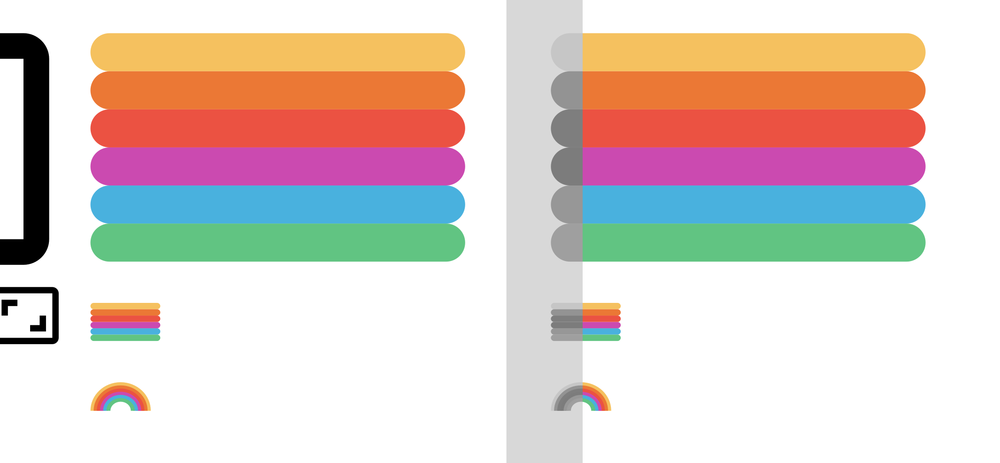
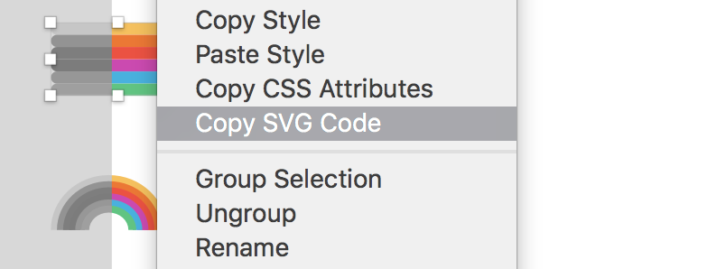

# Customizing Plugins with Coral UI


This is Part 2 of our Plugin Tutorial and assumes you've already completed [Building a Basic Plugin](/building-basic-plugin.md).

Note: We will be using Sketch in this tutorial to generate our SVG code. You can download Sketch here: https://www.sketchapp.com/.

## Coral UI

Within Talk, we have a set of tools we can leverage for our user interface, or UI. We simply call these tools Coral UI.

Within Coral UI, we have icons, buttons, alerts and other components. You can see all the elements available to use within `client/coral-ui`.

To get started using Coral UI, we're going to import it into our component.

```
import { Icon, Button } from 'plugin-api/beta/client/components/ui';

const myButton = () => 
    <Button>
        <Icon name="favorite" />
        Favorito
    </Button>
```

The Coral UI Icon component uses icons from Material Design. You can see the entire list of icons and their respective names  at [Material icons - Material Design](https://material.io/icons/).

## Using SVGs 

For the Pride Plugin icon, none of the Material icons really seemed to fit so we decided to be a little creative and make our own from scratch.

To do this, we needed to create two states:

- The inactive icon (before someone has clicked/reacted) 
- The active icon (after someone has clicked/reacted) 

To add a little additional creativity here, we thought that the inactive icon could be grayscale and the active one could be in full color. And a rainbow would be a great idea!



## Export / Copy SVG code

[Sketch](https://www.sketchapp.com/) gives us a way to export the SVG code:

* Right click on the SVG
* Click "Copy SVG code" or "Copy SVG code"



We can export it as a file or copy the inline code to our component. We personally prefer to have the inline code to have more control over the classes and the customization. In this case, we can pass different color palettes, `grayscale` and the other colors `colored`.

Then we can create `RainBowIcon.js` and write the following code:

```
import React from 'react';
import PropTypes from 'prop-types';

// Las paletas de colores que vamos a utilizar
const colorPalette = {
  grayscale: ['#C6C6C6', '#C6C6C6', '#7E7E7E', '#7C7C7C', '#7C7C7C', '#9F9F9F'],
  colored: ['#F5C15F', '#EB7835', '#EB5242', '#CB4AB0', '#49B1DE', '#61C482'],
};

const RainbowIcon = ({ paletteType = 'colored', palette = [] }) => {
  return (
    <svg
      width="19px"
      height="9px"
      viewBox="0 0 19 9"
      version="1.1"
      xmlns="http://www.w3.org/2000/svg"
    >
      <g stroke="none" strokeWidth="1" fill="none" fillRule="evenodd">
        <g transform="translate(-492.000000, -630.000000)">
          <g transform="translate(492.000000, 630.000000)">
            <path
              d="M9.5,0 C4.24785714,0 0,4.02428571 0,9 L2.71428571,9 C2.71428571,5.45142857 5.75428571,2.57142857 9.5,2.57142857 C13.2457143,2.57142857 16.2857143,5.45142857 16.2857143,9 L19,9 C19,4.02428571 14.7521429,0 9.5,0 Z"
              fill={palette[0] || colorPalette[paletteType][0]}
            />
            <path
              d="M9.5,1 C4.80071429,1 1,4.57714286 1,9 L3.42857143,9 C3.42857143,5.84571429 6.14857143,3.28571429 9.5,3.28571429 C12.8514286,3.28571429 15.5714286,5.84571429 15.5714286,9 L18,9 C18,4.57714286 14.1992857,1 9.5,1 Z"
              fill={palette[1] || colorPalette[paletteType][1]}
            />
            <path
              d="M9.5,2 C5.35357143,2 2,5.13 2,9 L4.14285714,9 C4.14285714,6.24 6.54285714,4 9.5,4 C12.4571429,4 14.8571429,6.24 14.8571429,9 L17,9 C17,5.13 13.6464286,2 9.5,2 Z"
              fill={palette[2] || colorPalette[paletteType][2]}
            />
            <path
              d="M9.5,3 C5.90642857,3 3,5.68285714 3,9 L4.85714286,9 C4.85714286,6.63428571 6.93714286,4.71428571 9.5,4.71428571 C12.0628571,4.71428571 14.1428571,6.63428571 14.1428571,9 L16,9 C16,5.68285714 13.0935714,3 9.5,3 Z"
              fill={palette[3] || colorPalette[paletteType][3]}
            />
            <path
              d="M9.5,4 C6.45928571,4 4,6.23571429 4,9 L5.57142857,9 C5.57142857,7.02857143 7.33142857,5.42857143 9.5,5.42857143 C11.6685714,5.42857143 13.4285714,7.02857143 13.4285714,9 L15,9 C15,6.23571429 12.5407143,4 9.5,4 Z"
              fill={palette[4] || colorPalette[paletteType][4]}
            />
            <path
              d="M9.5,5 C7.01214286,5 5,6.78857143 5,9 L6.28571429,9 C6.28571429,7.42285714 7.72571429,6.14285714 9.5,6.14285714 C11.2742857,6.14285714 12.7142857,7.42285714 12.7142857,9 L14,9 C14,6.78857143 11.9878571,5 9.5,5 Z"
              fill={palette[5] || colorPalette[paletteType][5]}
            />
          </g>
        </g>
      </g>
    </svg>
  );
};

// This is important to do so we pass the correct properties to the component
RainbowIcon.propTypes = {
  paletteType: PropTypes.oneOf(['colored', 'grayscale']),
  palette: PropTypes.array,
};

export default RainbowIcon;
````

Most of the component is code generated by Sketch, except for the properties that we can control control with the palettes. The color of the rainbow lines will be given based on the order of the colors of the palette.

We have two props for our component: `paletteType` and `palette`:

`paletteType`: since we we have two palettes we've created, we can pass these directly as `colored` and `greyscale`

`palette`: if we want to pass an array of colors we can do it using this property

Ready! So now we have our icon. Now let's modify the our button `PrideButton.js` to use our new icon.


```
import React from 'react';
import cn from 'classnames';
import styles from './PrideButton.css';
import { withReaction } from 'plugin-api/beta/client/hocs';
import RainbowIcon from './RainbowIcon';

class PrideButton extends React.Component {
  handleClick = () => {
    const { postReaction, deleteReaction, alreadyReacted } = this.props;

    if (alreadyReacted) {
      deleteReaction();
    } else {
      postReaction();
    }
  };

  render() {
    const { alreadyReacted } = this.props;
    return (
      <div className={cn(styles.container, 'talk-plugin-pride-container')}>
        <a
          className={cn(styles.button, 'talk-plugin-pride-button')}
          onClick={this.handleClick}
        >
          {alreadyReacted ? (
            <RainbowIcon />
          ) : (
            <RainbowIcon paletteType="grayscale" />
          )}
        </a>
      </div>
    );
  }
}

export default withReaction('pride')(PrideButton);
```

We will use the property `alreadyReacted` to change the icon and render one in grayscale (using the property `grayscale`).

There are many pros and cons of using inline SVGs that are outside the scope of this tutorial. If you'd like to learn more, you can read [5 Gotchas You're Gonna Face Getting Inline SVG Into Production](https://css-tricks.com/gotchas-on-getting-svg-into-production/) and its follow-up post [Part 2 Gotchas](https://css-tricks.com/gotchas-getting-inline-svg-production-part-ii/).

You can view the source code up to this point here: [talk-plugin-pride @ ae5c1a5](https://github.com/coralproject/talk-plugin-pride/commit/ae5c1a5e26390b9374c87ce5530d60c10b5c325e).

To keep performance top of mine, and given that this portion of SVG code can not be cached, we will create separate SVG files for the two icon states.

We will create the folder `assets` and place our two files inside it: `ColoredRainbowIcon.svg` and `GrayscaleRainbowIcon.svg`. We can export them both with Sketch or simply copy the SVG code into each file.

## Using an SVG in our components

We are going to import our SVG icons just as we did with our components, the only difference is the `.svg` at the end.

```
import ColoredRainbowIcon from '../assets/ColoredRainbowIcon.svg';
import GrayscaleRainbowIcon from '../assets/GrayscaleRainbowIcon.svg';
```

Since Webpack will give us the new url of the resource, we can us it like this:

```
            
```

## Using media queries

Now of course we will need to support several devices and browsers, so we'll need to make sure our plugin responds correctly. For this we can use media queries.

In this case, we want to make sure that on mobile devices that are less than 425px, the reaction label is not shown.

```
@media (max-width: 425px) {
  .label {
    display: none;
  }
}
```

If you look at our PostCSS configuration, you will notice that we use PreCSS. PreCSS allows us to optionally use a syntax that is similar to Sass and allows us to make use of variables:

```
@custom-media --viewport-medium (width <= 50rem);
@custom-selector :--heading h1, h2, h3, h4, h5, h6;

:root {
  --fontSize: 1rem;
  --mainColor: #12345678;
}

@media (--viewport-medium) {
  body {
    color: var(--mainColor);
    font-family: system-ui;
    font-size: var(--fontSize);
    line-height: calc(var(--fontSize) * 1.5);
    overflow-wrap: break-word;
    padding-inline: calc((var(--fontSize) / 2) + 1px);
  }
}
```

To learn more about PreCSS: https://github.com/jonathantneal/precss


## Adding animations

To make the user experience even more fun, we wanted the user to see a small animation when they click on our Pride Button:


```
.reacted {
  animation: rainbow 1s 1; 
}

@keyframes rainbow{
    20%{color: #EB5242;}
    40%{color: #F5C15F;}
    60%{color: #61C482;}
    80%{color: #49B1DE;}
    100%{color: #EB7835;}    
}
```

Now lets add this styling through our `classnames` library:


```
<button
  className={cn(
    styles.button,
    {[styles.reacted]: alreadyReacted}
  )}
  onClick={this.handleClick}
>
```

Perfect! Now every time a user clicks our reaction, the style is activated, and the animation is triggered.

This is what our completed Reaction now looks like:

```
import React from 'react';
import cn from 'classnames';
import styles from './PrideButton.css';
import { withReaction } from 'plugin-api/beta/client/hocs';
import ColoredRainbowIcon from '../assets/ColoredRainbowIcon.svg';
import GrayscaleRainbowIcon from '../assets/GrayscaleRainbowIcon.svg';

const plugin = 'talk-plugin-pride';

class PrideButton extends React.Component {
  handleClick = () => {
    const { postReaction, deleteReaction, alreadyReacted, user } = this.props;

    // If the current user does not exist, trigger sign in dialog.
    if (!user) {
      showSignInDialog();
      return;
    }

    if (alreadyReacted) {
      deleteReaction();
    } else {
      postReaction();
    }
  };

  render() {
    const { count, alreadyReacted } = this.props;
    return (
      <div className={cn(styles.container, `${plugin}-container`)}>
        <button
          className={cn(
            styles.button,
            {
              [`${styles.reacted} talk-plugin-pride-reacted`]: alreadyReacted,
            },
            `${plugin}-button`
          )}
          onClick={this.handleClick}
        >
          <span className={cn(`${plugin}-label`, styles.label)}>Pride</span>
          {alreadyReacted ? (
            
          ) : (
            
          )}
          <span className={cn(`${plugin}-count`)}>{count > 0 && count}</span>
        </button>
      </div>
    );
  }
}

export default withReaction('pride')(PrideButton);

```

To view the completed source code, look here: https://github.com/coralproject/talk-plugin-pride
